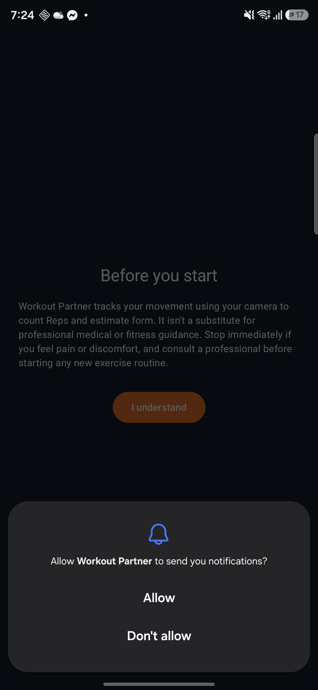
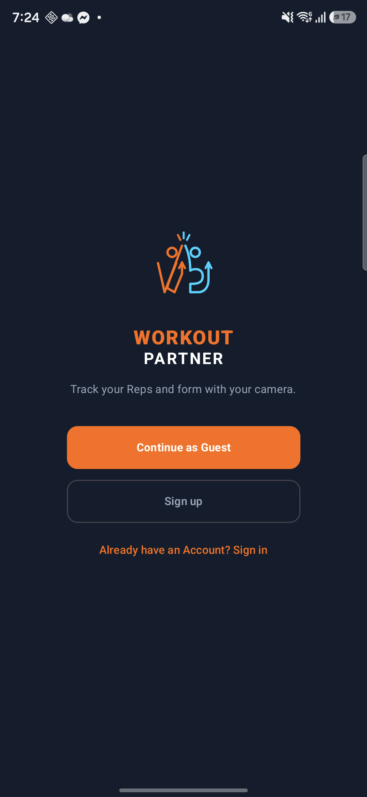

# Workout Partner 🏋️‍♂️

> **An on-device AI workout companion engineered for privacy, autonomous form feedback, and sustainable fitness habits.**

[](https://kotlinlang.org)
[-green.svg)](https://developer.android.com)
[](https://developer.android.com)
[-4285F4.svg?logo=jetpackcompose)](https://developer.android.com/jetpack/compose)
[](https://developers.google.com/mediapipe)
[-orange.svg)](https://developer.android.com/training/data-storage/room)
[](https://firebase.google.com)

---

<p align="center">
  
  &nbsp;&nbsp;&nbsp;&nbsp;
  
</p>

---

## 📌 Project Identity & Core Philosophy

**Workout Partner** is an Android application that uses **on-device computer vision and kinematic pose estimation** to count exercise repetitions and assess movement form in real time — for people exercising on their own and for coaches/trainers counting reps on someone else's behalf (**Quick Count**).

### Core Pillars

1. **100% On-Device Privacy**: No camera feeds, video frames, or workout images are ever uploaded to a server or external cloud. All computer vision inference (33 skeletal landmarks), rep state machines, and form calculations run locally on the phone's hardware.
2. **Autonomous Long-Distance UX**: Designed around the physical reality of home fitness: athletes stand **1.8m – 2.5m away** from their device. The interface replaces unreadable text during workouts with glanceable visual cues, high-contrast HUDs, audio cues, and an automated **Position Check**.
3. **Sustainable Habit Formation**: Replaces punishing daily streak mechanics with a flexible, Duolingo-inspired **Weekly Target & Streak Shield** model. Rest days are treated as essential recovery rather than failures.
4. **Zero-Friction Offline Parity**: Full functionality for **Guests** without requiring an account. Everything is stored in an on-device Room database first, with background synchronization to Cloud Firestore once an account is linked.

---

## 📲 Download & Install the APK

### 1. Direct Download (Latest Release)
Download the pre-compiled APK directly to your Android device from the GitHub Releases page:
- 📥 **[Download Latest APK](https://github.com/dpduc/WorkoutPartner_android/releases/latest)**

### 2. How to Install on Your Android Device
1. On your Android phone, download the `.apk` file using Chrome or your browser.
2. When prompted, tap **Open**, then select **Install**.
3. If this is your first time sideloading an APK, allow permission:
   - Go to **Settings** &rarr; **Apps** &rarr; **Special App Access** &rarr; **Install unknown apps**.
   - Enable **Allow from this source** for your browser or file manager.
4. Launch **Workout Partner** and grant Camera permissions when prompted.

### 3. Build & Install Locally via ADB
If you have the source code cloned and Android SDK configured:

```bash
# 1. Build the debug APK
./gradlew assembleDebug

# 2. Install directly onto a connected device or running emulator
adb install -r app/build/outputs/apk/debug/app-debug.apk
```

---

## ✨ Features: What Workout Partner Offers

### 👁️ Real-Time On-Device Pose Tracking
- **MediaPipe Pose Landmarker**: Tracks 33 body landmarks at 30 fps directly on the device using Google MediaPipe Tasks Vision in `LIVE_STREAM` mode.
- **5 Core Exercises + Low-Impact Variant**:
  - **Squat**: Hip & knee flexion state machine with depth threshold validation.
  - **Push-up**: Elbow angle tracking with horizontal plane alignment.
  - **Sit-up**: Torso-to-femur angle monitoring from floor positions.
  - **Lunge**: Dual-leg knee angle tracking with alternate-leg support.
  - **Jumping Jack**: Arm-shoulder abduction angle tracking.
  - **Step Jack (Low-Impact Variant)**: Dedicated variant for athletes with high BMI ($\ge 30$) or joint sensitivity, with specialized rep ($\ge 75^\circ$) and form ($\ge 110^\circ$) thresholds.
- **Form Score & Good Sets**: Reps are evaluated for Range of Motion (ROM). A **Good Set** requires meeting *both* the rep count target *and* the minimum form score threshold.
- **Lost-Tracking Detection**: Automatically pauses workout timers and counters when the athlete steps out of camera frame, resuming seamlessly upon return.

### 📐 The "Before You Start" Long-Distance UX
Overcomes the challenge of operating a phone from 1.8m – 2.5m away:
- **Workout Overview**: Summary of exercises, targets, and expected duration.
- **Form Guides**: Illustrated technique cues and common mistakes shown once per new exercise (always reviewable).
- **Automated Position Check**:
  - Distance check (verifies skeleton height proportions).
  - Whole-body framing check (head to ankles in frame).
  - 2-second stillness validation to automatically initiate countdown without touching the screen.
  - 15-second "Start anyway" manual bypass.

### 📋 Guided Routines & AMRAP Modes
- **10 Bundled Routines**: Curated flat sequences targeting full-body, upper, lower, and core splits without complex looping configurations.
- **AMRAP Benchmark Mode**: "As Many Rounds As Possible" timed benchmark circuit scored as `completed Rounds × reps per Round + extra reps`.

### 🔥 Duolingo-Style Weekly Streaks
- **Weekly Target**: Configurable goal (default: 3 Active Days/week).
- **Streak Shields**: Automatically earned by hitting weekly targets; banked and consumed to protect streaks during missed weeks or holidays.
- **3-Day Inactivity Safeguard**: Breaks a streak if 3 consecutive calendar days have zero activity, preventing unhealthy last-minute "cramming".

### ⏱️ Quick Count for Rosters (Coach Mode)
- Record reps for someone else without polluting your own personal workout history.
- Athletes can manage a **Roster** of **Tracked Profiles** (lightweight names with no accounts).
- Runs the pose engine with raw rep counting (no form score gating), saving results as **Tallies** associated with that profile.

### ☁️ Offline-First & Multi-Device Cloud Sync
- **Local Source of Truth**: All workouts, sets, profiles, and streak calculations write directly to Room SQLite first.
- **Deferred WorkManager Sync**: Background jobs push changes to Cloud Firestore when internet connectivity is available.
- **Guest-to-Account Migration**: Full feature access without an account. Once an account is registered (Email/Password or OAuth), local data migrates in an atomic transaction.

---

## 🚀 How to Use

```
┌─────────────────┐     ┌──────────────────────┐     ┌──────────────────────┐     ┌─────────────────┐
│  Select Workout │ ──> │  Before You Start    │ ──> │  Live Camera HUD     │ ──> │  Summary & Form │
│  (Routine/AMRAP)│     │  (Position Check)    │     │  (Pose & Form Reps)  │     │  (Streak Shield)│
└─────────────────┘     └──────────────────────┘     └──────────────────────┘     └─────────────────┘
```

1. **Open the App**: Choose to continue as a **Guest** or create an **Account**.
2. **Onboarding Body Stats**: Enter basic stats (Height, Weight, Activity Level). If your BMI is 30+, the app automatically suggests low-impact variants like Step Jack.
3. **Pick a Workout Mode**:
   - **Routines**: Pick one of the 10 bundled workouts.
   - **AMRAP**: Test your baseline against the clock.
   - **Quick Count**: Select a person from your Roster to count their reps.
4. **Before You Start**:
   - Review any new **Form Guides**.
   - Prop your phone upright in portrait mode at chest height, ~2 meters away.
   - Step back until the **Position Check** turns green and hold still for 2 seconds.
5. **Workout**: Follow the live camera HUD. Audible beeps confirm counted reps; on-screen skeleton lines show joint angles and form quality.
6. **Set Rest & Summary**: Review your Form Score, rest during the skippable rest timer, and bank progress toward your **Weekly Target**.

---

## 🏛 Architecture & Modular Design

The codebase enforces clean separation of concerns across a 5-module Gradle architecture:

```
WorkoutPartner_android/
├── app/                  # UI Layer: Jetpack Compose, Material 3, Navigation, ViewModels, DI
├── core-pose-tracking/   # Vision Layer: CameraX, MediaPipe Tasks Vision, Video Decoder (OpenGL ES)
├── core-rep-counting/    # Seam 1: Pure Kotlin kinematic state machines & Form Score calculation
├── core-streaks/         # Seam 2: Pure Kotlin weekly streak, shield, and active day algorithms
└── data/                 # Seam 3: Room DB, Firestore sync queue, Auth gateways, Migration logic
```

### Architectural Seams & Testing Boundaries

- **Seam 1 (`:core-rep-counting`)**: Pure Kotlin domain logic with **zero Android framework dependencies**. Consumes normalized 3D pose landmarks and produces `Rep` events and `Form Score`. Unit tested against landmark fixtures in milliseconds on the JVM.
- **Seam 2 (`:core-streaks`)**: Functional streak computation engine. Takes active day timestamps, target rules, and an injected clock to compute streak state without database or system time dependencies.
- **Seam 3 (`:data`)**: Offline-first repository layer (`SetRepository`, `AccountRepository`, `RosterRepository`). Uses Room with Robolectric for fast in-memory SQLite testing and fake remote gateways for cloud sync verification.

### System Data Flow

```mermaid
flowchart LR
    A[CameraX Feed / Video] --> B[MediaPipe Landmarker]
    B -->|33 Normalized Landmarks| C[:core-rep-counting State Machine]
    C -->|Rep Counted + Form Score| D[ViewModel / Compose HUD]
    D -->|Persist Completed Set| E[Room SQLite Database]
    E -->|Sync Queue| F[WorkManager Sync Worker]
    F -->|Background Sync| G[Cloud Firestore]
```



---

## 🛠 Tech Stack & Engineering Decisions

| Layer | Technology | Decision Rationale & Trade-offs |
|---|---|---|
| **Language** | Kotlin 2.4 | Single modern language across all 5 modules; JVM 17 target. |
| **UI Framework** | Jetpack Compose (BOM 2026.09) | Declarative UI, reactive state management, Material 3 design system. |
| **Camera Vision** | MediaPipe Tasks Vision 1.0 + CameraX 1.6 | 33-point pose landmarking running locally at 30 fps; lifecycle-safe camera binding. |
| **Local DB** | Room 2.8 (KSP) | Offline-first single source of truth; fast reactive queries with Kotlin Flow. |
| **Cloud Sync** | Firebase Auth & Firestore (BOM 34.19) | Multi-device backup and unified backend shared with a companion Web dashboard. |
| **Background Work**| WorkManager 2.11 | Battery-efficient, guaranteed deferred synchronization of workout records. |
| **Hardware Decode**| `MediaCodec` + OpenGL ES (`GlFrameReader`) | Custom sequential video decode pipeline for debug replay (see Case Study below). |
| **Testing** | JUnit 4 + Robolectric 4.16 | Fast JVM-based testing for pure logic and Room DBs without requiring a physical device. |

### Technical Highlights & Case Studies

#### 🏎️ Hardware-Accelerated Video Pipeline Case Study
To test rep-counting accuracy without standing in front of a camera, the app includes a debug video replay engine (`VideoPoseTracker`). 
- **The Problem**: Initial implementations using `MediaMetadataRetriever.getFrameAtTime()` took over 11 minutes to analyze a 37-second clip due to keyframe seeking, dropping significant frames and undercounting reps (5 counted vs 35 actual).
- **Device Native Crashes**: Moving to hardware decoders crashed CPU memory readbacks (`Image.getPlanes()`) due to Qualcomm UBWC tiled buffer compression; software decoders fatally crashed on real camera HEVC content.
- **The Solution**: Designed a hardware-accelerated pipeline using `MediaExtractor` + `MediaCodec` outputting to a `SurfaceTexture`, sampled by a dedicated **OpenGL ES 2.0 pass-through shader pipeline (`GlFrameReader`)**.
- **The Result**: Reduced decode time from **11 minutes to real-time (~37s)** with zero dropped frames (566 analyzed frames vs 282 previously). Documented in [engineering-decisions.md](docs/engineering-decisions.md).

#### 🛡️ Camera Session Robustness
- **Screen Wake Lock**: Prevents screen sleep during active tracking using `keepScreenOn`.
- **Foreground Service**: Employs `CameraTrackingService` (`foregroundServiceType="camera"`) with persistent notifications to prevent Android 10+ process reclamation.
- **Field-Level Security Rules**: Firestore security rules lock historical Sets and Tallies as create-only/immutable to preserve fitness record integrity ([ADR-0010](docs/adr/0010-android-owner-writes-with-field-limits.md)).

---

## 📖 Domain Glossary

To ensure alignment across code, data schemas, and documentation (as defined in [CONTEXT.md](CONTEXT.md)):

| Term | Meaning | Term to Avoid |
| :--- | :--- | :--- |
| **Athlete** | The person using the app (either an Account holder or a Guest). | *User, Profile, Player* |
| **Account** | An Athlete with a registered identity (adds cloud sync/backup). | *User, Profile* |
| **Guest** | An Athlete using local storage only; data migrates upon account creation. | *Anonymous user* |
| **Exercise** | One of the 5 supported movements: *Squat, Push-up, Sit-up, Lunge, Jumping Jack*. | - |
| **Exercise Variant**| Specialized variation with unique thresholds (e.g., *Step Jack* for low impact). | *Modification, Regression* |
| **Rep** | One complete kinematic motion cycle detected by the exercise state machine. | *Repetition* |
| **Form Score** | Quality percentage based on range-of-motion and joint angle thresholds. | *Accuracy, Quality score* |
| **Good Set** | A Set meeting **both** its target rep count AND form score threshold. | - |
| **Session** | One complete execution of a Routine, containing one or more Sets. | *Workout* |
| **Set** | A continuous block of Reps of a single Exercise within a Session. | - |
| **Active Day** | A calendar day with at least one completed Set (counted once per day). | *Session* |
| **Streak** | Count of consecutive Weeks in which the Athlete met their Weekly Target. | *Daily streak* |
| **Streak Shield**| A credit banked by meeting weekly targets, protecting against a missed week. | - |
| **Roster** | Collection of Tracked Profiles managed by an Athlete. | - |
| **Tracked Profile**| Lightweight person record created for Quick Count (no login). | *Student, Coachee, Buddy*|
| **Quick Count** | Mode to record reps for a Tracked Profile with no Form Score gating. | *Coach mode, Roster mode*|
| **Tally** | Record produced by a Quick Count run for a Tracked Profile. | *Count, Quick Set* |

---

## 💻 Developer Setup & Testing

### Prerequisites
- **JDK 17** (e.g. JetBrains Runtime bundled with Android Studio: `C:\Program Files\Android\Android Studio\jbr`).
- **Android SDK** (API 26 to 34).

### Environment Configuration (Windows PowerShell)
```powershell
$env:JAVA_HOME = "C:\Program Files\Android\Android Studio\jbr"
$env:Path = "$env:JAVA_HOME\bin;C:\Users\teflo\AppData\Local\Android\Sdk\platform-tools;$env:Path"
```

### Running Tests

```bash
# Run unit tests across all modules
./gradlew testDebugUnitTest

# Run pure domain state machine tests (Seam 1)
./gradlew :core-rep-counting:test

# Run functional streak engine tests (Seam 2)
./gradlew :core-streaks:test

# Run Room database & repository tests (Seam 3)
./gradlew :data:testDebugUnitTest
```

### Video Clip Ground-Truth Testing
Offline replay test suites verify rep-counting accuracy against known video clips:
1. Push test video to device via ADB as documented in [docs/test-clips.md](docs/test-clips.md).
2. Run `ClipReplayTest` to assert counted reps against ground-truth truth files (`.truth.txt`).

---

## 📂 Project Structure

```
├── .scratch/               # Product specifications, user stories, and issue tracking
├── docs/                   # Architecture Decision Records (ADR 0001–0010) & Technical Highlights
│   ├── adr/                # Formal Architecture Decision Records
│   ├── engineering-decisions.md  # Portfolio technical deep-dive
│   ├── before-you-start-system.md# Long-distance camera UX specification
│   └── test-clips.md       # Ground-truth video dataset guide
├── app/                    # Jetpack Compose UI, Material 3, Navigation, ViewModels
├── core-pose-tracking/     # CameraX, MediaPipe Tasks Vision, and OpenGL ES Video Decoder
├── core-rep-counting/      # Pure Kotlin exercise state machines & form evaluators
├── core-streaks/           # Pure Kotlin weekly streak, shield, and active day calculations
├── data/                   # Room database, entity schemas, Firestore sync, Auth
├── CONTEXT.md              # Official domain terminology & product boundaries
└── README.md               # Main project documentation
```

---

## 📄 License

Internal project for development, research, and evaluation. All rights reserved.
